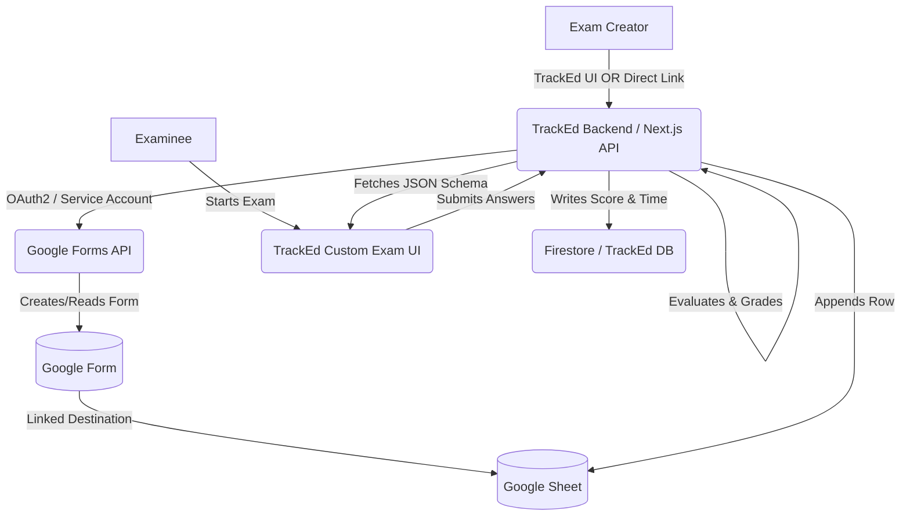

# TrackEd Exam System: Google Forms Integration Architecture

## 1. System Architecture & Workflow

By utilizing Google Forms as the backend for question storage and Google Sheets as the persistent layer for responses, we offload the heavy lifting of data capture while maintaining a completely custom, white-labeled frontend experience in TrackEd.

### Architecture Workflow



### Modes of Creation
1. **TrackEd Custom UI Creation:** Creator uses TrackEd to build the exam. TrackEd uses the `forms.create` API to programmatically generate a Google Form and set up a linked Google Sheet.
2. **Direct Link Import:** Creator pastes an edit link to an existing Google Form. TrackEd uses the `forms.get` API to read the structure and import the questions.

### Examinee Experience
1. **Fetch:** TrackEd Server fetches the Form structure.
2. **Strip Answers:** The server strips any correct answer data before sending the payload to the client.
3. **Render:** The TrackEd React frontend renders custom Radio buttons, Checkboxes, and Textareas.
4. **Submit:** The client sends the selected option IDs and `time_taken_seconds` to the TrackEd Server.
5. **Grade & Sync:** The server grades the submission against the hidden answer key, calculates negative marking, writes the final ranking to Firestore (for realtime leaderboards), and optionally appends the raw result payload to the linked Google Sheet via the Sheets API.

---

## 2. Google Integration Architecture & APIs

### Authentication
We use a **Google Cloud Service Account** with Domain-Wide Delegation or standard OAuth 2.0 (if the creator must own the form). For seamless app-owned forms, a Service Account is preferred.

Required Scopes:
- `https://www.googleapis.com/auth/forms.body` (To create/read forms)
- `https://www.googleapis.com/auth/spreadsheets` (To read/append results)

### Node.js Boilerplate: Fetching & Parsing Form Schema

```javascript
// lib/googleForms.js
import { google } from 'googleapis';

// Initialize the Forms API client
const auth = new google.auth.GoogleAuth({
  keyFile: './service-account.json', // Path to your service account key
  scopes: ['https://www.googleapis.com/auth/forms.body.readonly'],
});

const forms = google.forms({ version: 'v1', auth });

/**
 * Fetches a Google Form and parses it into a clean JSON structure for TrackEd frontend.
 */
export async function getExamSchema(formId) {
  try {
    const res = await forms.forms.get({ formId });
    const form = res.data;
    
    // Parse the form items structure
    const questions = form.items
      .filter(item => item.questionItem) // Only get actual questions
      .map(item => {
        const qItem = item.questionItem.question;
        const choices = qItem.choiceQuestion?.options?.map(opt => ({
          value: opt.value,
          id: opt.id // Internal choice ID
        })) || null;

        return {
          id: item.itemId,
          title: item.title,
          type: qItem.choiceQuestion ? 'MCQ' : 'TEXT',
          options: choices,
          points: qItem.grading?.pointValue || 0,
          // CRITICAL: We do NOT map qItem.grading.correctAnswers here.
          // Correct answers are evaluated server-side.
        };
      });

    return {
      formId: form.formId,
      title: form.info.title,
      description: form.info.description,
      questions: questions,
    };
  } catch (error) {
    console.error('Error fetching Google Form:', error);
    throw error;
  }
}
```

### Grade & Append Logic (Server-Side)

When the user submits to `/api/exams/submit`:
1. Use `forms.get` to fetch the form and extract `qItem.grading.correctAnswers`.
2. Compare client responses with correct answers.
3. Calculate: `Total Score = (Correct * Points) - (Incorrect * NegativeMarkingFactor)`.
4. Append to Sheets using `sheets.spreadsheets.values.append`.

```javascript
// Google Sheets Append Example
const sheets = google.sheets({ version: 'v4', auth });
await sheets.spreadsheets.values.append({
  spreadsheetId: linkedSheetId,
  range: 'Sheet1!A:F',
  valueInputOption: 'USER_ENTERED',
  requestBody: {
    values: [[ userId, userName, totalScore, timeTakenSeconds, new Date().toISOString(), JSON.stringify(responses) ]]
  }
});
```

---

## 3. Customization Logic (Timers, Ranking, Negative Marking)

Because the exam is taken on TrackEd's frontend, we encapsulate the Google Form questions inside TrackEd's control logic.

- **Exam Configuration:** Stored in Firestore (e.g., `duration_mins`, `negative_marking`, `competition_mode_enabled`).
- **Timer Enforcement:** 
  - Client-side countdown running.
  - Server-side validation: The server records `exam_start_time` when the student clicks "Start". When `/submit` is called, the server verifies that `current_time - exam_start_time <= duration_mins + grace_period`. 
- **Leaderboard Syncing:** Once the server calculates the final score and exact `timeTakenSeconds`, it writes to a Firestore `exam_leaderboards` collection to enable instant Firebase snapshot updates to the frontend.

---

## 4. Security & Anti-Cheat Guidelines

Securing a decoupled architecture requires strict server-side validation.

### 1. Zero-Knowledge Frontend
**Rule:** Never send the answer key to the client.
Because the Google Forms API returns the structure *including* the answer key (`grading.correctAnswers`), the TrackEd Node.js API must intercept the response and actively strip the correct answers before returning the JSON payload to the examinee's browser.

### 2. Time Tampering Prevention
Clients can pause local timers.
**Solution:** The TrackEd server generates a secure `started_at` timestamp in Firestore when the user requests the exam questions. 
At submission, the server calculates: `time_taken = current_timestamp - started_at`. If `time_taken` exceeds the allotted time limits, the server rejects the submission or applies a penalty.

### 3. Submission Replay Attacks
**Rule:** Ensure idempotency.
When a student submits hardware, track `is_submitted: true` in Firestore against their `user_id` and `exam_id`. Any subsequent submission requests for that exam ID are blocked.

### 4. Visibility and Window Blur Hooks (Client-Side)
Although client-side checks can be bypassed, they deter casual cheating.
```javascript
// TrackEd Custom Exam UI Component
useEffect(() => {
  const handleVisibilityChange = () => {
    if (document.hidden) {
      recordWarning('User switched tabs or minimized window.');
    }
  };
  document.addEventListener('visibilitychange', handleVisibilityChange);
  return () => document.removeEventListener('visibilitychange', handleVisibilityChange);
}, []);
```
